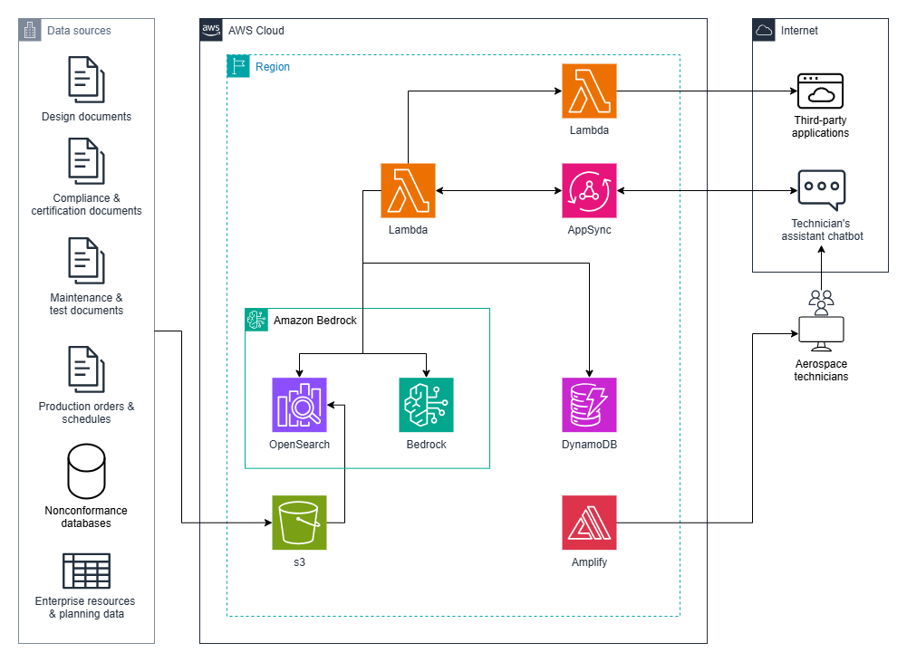

# Guidance for Automating Non-Conformance Reviews on AWS

## Overview

A Next.js and AWS Amplify-based chatbot designed to streamline aerospace maintenance operations by providing intelligent access to Non-Conformance Report (NCR) documentation with integrated Jira issue management capabilities.

This solution addresses the critical challenge faced by aerospace technicians who need rapid, accurate access to technical documentation while handling non-conformance issues in aircraft maintenance. By combining AWS Bedrock's AI models with OpenSearch vector search, the system enables natural language queries across complex technical documentation, significantly reducing the time needed to find relevant information and initiate corrective actions.

Key benefits include:
- Instant access to relevant NCR documentation through natural language queries
- Automated Jira issue creation and management for non-conformance tracking
- Real-time AI assistance for technical documentation interpretation
- Seamless integration with existing aerospace maintenance workflows
- Vector search capabilities for precise document retrieval



## Cost

_You are responsible for the cost of the AWS services used while running this Guidance. As of April 2025, the cost for running this Guidance with the default settings in the US East (N. Virginia) Region is approximately $510.00 per month for processing (10,000 requests) per day._

The cost estimate is based on the following assumptions:
- 100 active users per month
- 10,000 API calls per month
- 1GB S3 storage for knowledge base documents
- Moderate OpenSearch Serverless usage
- Regular Bedrock model invocations for chat interactions
- Standard VPC endpoint usage

AWS Pricing Calculator: [Solution](https://calculator.aws/#/estimate?id=6509aa0c9eec2a3e20f3b7628141cf0e1d44f0ed)

Prices are subject to change. For full details, refer to the pricing webpage for each AWS service used in this Guidance.

### Cost Table

The following table provides a sample cost breakdown for deploying this Guidance with the default parameters in the US East (N. Virginia) Region for one month.

| AWS service           | Dimensions                                                   | Cost [USD]  |
|-----------------------|--------------------------------------------------------------|-------------|
| AWS Amplify           | 10,000 SSR requests per day                                  | $23.70      |
| AWS AppSync           | 10,000 REST API calls per day                                | $9.18       |
| Amazon Cognito        | 100 active users per month without advanced security feature | $0.00       |
| Amazon S3             | 1GB storage, 10K PUT/GET requests                            | $0.08       |
| OpenSearch Serverless | 1 OCUs, 1GB storage                                          | $350.42     |
| AWS Lambda            | 10K invocations, 512MB memory, 5s avg duration               | $6.01       |
| Amazon Bedrock        | 100M tokens processed                                        | $32.00      |
| Amazon DynamoDB       | 1GB storage                                                  | $0.46       |
| VPC Endpoints         | 2 interface endpoints                                        | $87.61      |
| **Total**             |                                                              | **$509.46** |


## Prerequisites

### Required Software
- Node.js v20 or later
- npm v9 or later
- Git v2.30 or later
- AWS CLI v2.x

### AWS Account Requirements
- AWS Account with administrator access
- AWS IAM user with appropriate permissions
- AWS Default VPC
- AWS Bedrock access enabled in your account

### Third-Party Services
- Jira Cloud account with API access
- Jira API credentials (API token and username)

### Remote Deployment (AWS Amplify Console)
1. Fork and clone the repository:
```powershell
# Fork and clone
git clone https://github.com/aws-solutions-library-samples/guidance-for-automating-non-conformance-reviews-on-aws
cd guidance-for-aerospace-technicians-assistant-on-aws
```
Note: To ensure a better experience within AWS Amplify Console, fork the solution into your own repository.

2. Access AWS Amplify Console:
  - Log in to AWS Console
  - Navigate to AWS Amplify
  - Select "Create new app"

3. Connect Repository:
  - Choose your repository provider
  - Select the repository and branch

4. App settings:
  - Expand Advanced settings
  - Add environment variables
    ```env
    VPC_ID=<your-vpc-id>
    AVAILABILITY_ZONES=<your-az-list>
    VPC_CIDR_BLOCK=<your-vpc-cidr>
    PUBLIC_SUBNET_IDS=<your-subnet-ids>
    
    # If you don't add Jira envs, this feature will be disabled
    JIRA_API_ENDPOINT=<your-jira-endpoint>
    JIRA_API_KEY=<your-jira-api-key>
    JIRA_USERNAME=<your-jira-username>
    ```

5. Deploy:
  - Review settings
  - Click "Save and deploy"
  - Monitor build and deployment progress in the Amplify Console

6. Access Application:
  - Once deployed, access your application using the provided Amplify URL

## Upload Aircraft manuals
Once the solution is deployed, you still have to manually upload all Aircraft manuals.
- Log in to AWS Console
- Navigate to S3
- Click on "ncr-knowledge-base-bucket-%branch%"
- Upload your manuals
  * If you don't have your own manuals, you can find some examples here:
    ```
    .
    ├── assets/                       # Assets
    │   ├── manuals/                  # Aircraft manuals
    │   │   ├── *.zip                 # Unzip before uploading 
    ```

After that, you have to Sync your knowledge base 
- Navigate to Amazon Bedrock
- Select Knowledge Bases
- Click on "ncr-knowledge-base-%branch%"
- Check the "ncr-data-source" and click on "Sync"

Now your whole setup is done. Enjoy it.

## Local Development (Remote deployment is required)

**Note: This application has been tested only on Windows environments for local development.**

1. Copy amplify_outputs.json file:
* Follow [4. Set up local environment](https://docs.amplify.aws/react/start/quickstart/#4-set-up-local-environment) from the Amplify documentation
* Note: Only ignore the cloning step

2. Start Local Development:
```powershell
# Install dependencies
npm install
```

3. Add environment variables
```
VPC_ID=<your-vpc-id>
AVAILABILITY_ZONES=<your-az-list>
VPC_CIDR_BLOCK=<your-vpc-cidr>
PUBLIC_SUBNET_IDS=<your-subnet-ids>

# If you don't add Jira envs, this feature will be disabled
JIRA_API_ENDPOINT=<your-jira-endpoint>
JIRA_API_KEY=<your-jira-api-key>
JIRA_USERNAME=<your-jira-username>
```

4. Configure AWS Amplify Sandbox:
```powershell
# Create new Amplify sandbox environment
npx ampx sandbox --profile <aws-profile-name> --once
```
This step will add a whole new environment, be aware that resources and costs will double if you already have a deployed branch via Amplify console.

5. Start Local UI:
```powershell
# Start local front-end
npm run dev
```

## Repository Structure
```
.
├── amplify/                      # AWS Amplify backend configuration and resources
│   ├── auth/                     # Authentication configuration
│   ├── backend.ts                # Main backend infrastructure definition
│   ├── custom_resources/         # Custom AWS resources (OpenSearch index creation)
│   └── data/                     # Data handlers and resolvers
├── assets/                       # Assets
│   ├── manuals/                  # Aircraft manuals
├── src/
│   ├── app/                      # Next.js application routes and pages
│   │   ├── chat/                 # Chat interface components
│   │   └── page.tsx              # Main application entry point
│   ├── components/               # Reusable React components
│   │   ├── Layout/               # Application layout components
│   │   └── Sidebar/              # Chat sidebar navigation
│   └── providers/                # React context providers
├── amplify.yml                   # Amplify CI/CD configuration
├── package.json                  # Project dependencies and scripts
└── tsconfig.json                 # TypeScript configuration
```

## Troubleshooting
  - Error while creating S3 bucket
    * S3 bucket is created based on the branch name, pay attention to special characters that are not allowed
    * https://docs.aws.amazon.com/AmazonS3/latest/userguide/bucketnamingrules.html